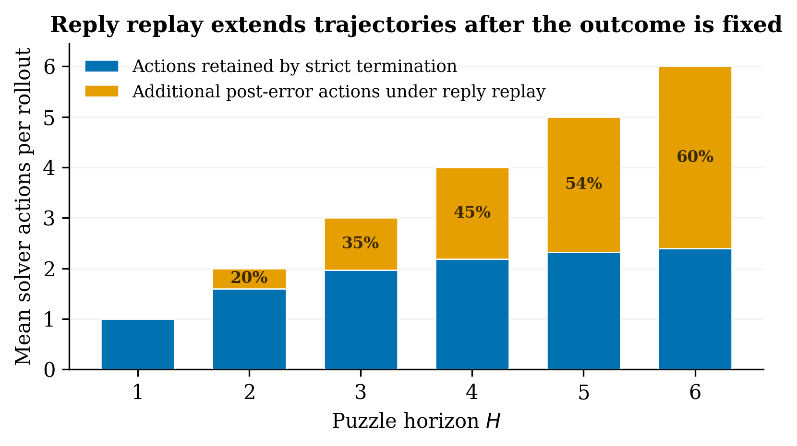
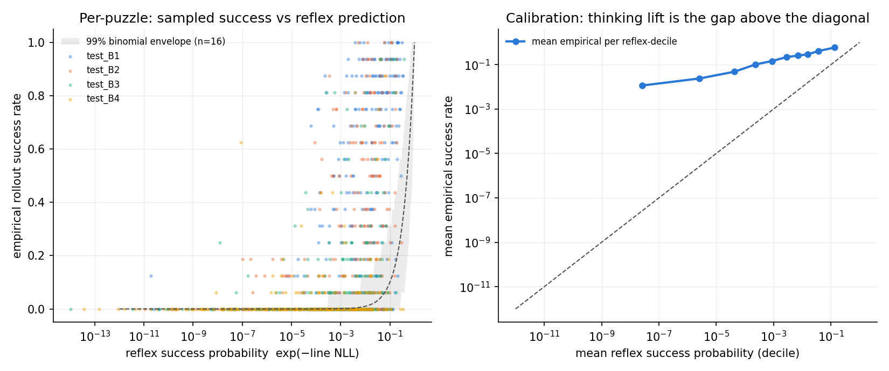
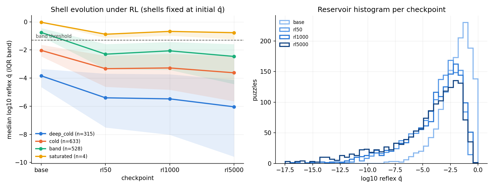

# Policy-Environment Learnability

Sparse terminal reward can train a policy only when the current policy, the environment, and the rollout allocation jointly produce contrasting outcomes. This sandbox studies that boundary, and it comes before any optimizer comparison, because a batch with no contrast in it makes every update rule look alike.

`rl_sandbox` asks how an update rule weights a batch that has already been collected. The question here sits one step upstream: whether the batch carries a task direction at all, and whether the policy tokens receiving credit could have changed the outcome. That second question turns out to organize the whole relationship between pretraining, SFT, distillation, and online RL, since each stage changes which successful trajectories the next stage can see and therefore learn from.

## The reward-contrast boundary

Consider a task with a unique successful path and $D$ uncertain decisions. If the policy selects the correct action with probability $p_t$ at decision $t$, the probability of a successful trajectory is

```math
q = \prod_t p_t
```

For the homogeneous analytical environment, $p_t = p$ and $q = p^D$. A group-centered estimator with $K$ trajectories receives a nonzero task direction only when the group contains both successes and failures, because a group whose rewards are all identical centers to zero. The probability of drawing a mixed group is

```math
M(q, K) = 1 - q^K - (1 - q)^K
```

This produces three learning regimes:

- **Cold**, where the product $qK$ falls far below one. Groups are almost always all-failure, so an on-policy outcome reward supplies no direction.
- **Contrastive**, where success and failure coexist within groups, so relative advantages can identify the behavior associated with reward.
- **Saturated**, where $(1-q)K$ falls far below one. Groups are almost always all-success, and the centered reward again supplies no direction.

What this makes the useful object is a distribution over task-level $q$, and one aggregate accuracy cannot stand in for it. Two policies with identical pass@1 can place very different fractions of their tasks inside the contrastive regime, and that fraction is what decides how much of a batch carries gradient.

Because $M(q, K)$ is appreciable only over a window of $q$ roughly a decade wide, it is convenient to speak of the task population as sitting in bands around that window. The **contrastive band** is the window itself, where online group RL can move mass. Above it sits **saturated** mass, already solved and no longer informative. Below it sits the **cold** shoulder, close enough that a modest improvement lifts a task into the band, and below that a **deep-cold** tail that no realistic amount of on-policy sampling will reach. The cold and deep-cold mass together form the **reservoir**: the supply of tasks that RL can still convert, drawn down as training proceeds. Throughout this document a **shell** means a fixed bin of that $q$ histogram, spaced by decade, which is the unit `transfer_shells.py` and the deconvolution in Result 6 report in.

One strong simplifying assumption holds the reservoir picture together, and several results below exist to test it. Under the **diagonal approximation**, RL moves each task along its own $q$ and does nothing else, so a task converts because its own success probability rose into the band, never because learning on some other task generalized to it. Off-diagonal transfer, if it exists, would refill the reservoir from below at the same time as conversion drains it from above. Those two flows cancel in any aggregate accuracy number, which is why separating them takes the tail moments Result 6 measures.

### Group size under a fixed rollout budget

Increasing $K$ raises the probability that any one prompt group contains contrast. It also concentrates a fixed rollout budget on fewer prompts. With $B$ trajectories arranged into groups of size $K$,

```math
\begin{aligned}
\text{expected successful trajectories} &= Bq \\
\text{expected mixed prompt groups} &= \frac{B}{K}\, M(q, K)
\end{aligned}
```

Group size reorganizes the available successes and creates none of them. A larger group exposes more trajectories to a within-prompt baseline while reducing independent prompt coverage. That trade is why group size, curriculum, and SFT are not interchangeable remedies for sparse reward. Each one moves a different term of the same expression, so reaching for whichever is cheapest at hand can leave the binding term untouched.

## How training stages move the boundary

The usual stage names hide the mechanism. Their roles become clearer when expressed through support, decision depth, and reward contrast.

| Intervention | Primary effect on the next stage |
|---|---|
| More capable pretraining | Raises conditional competence and places useful actions in support |
| Reasoning-trace SFT | Raises trajectory support across intermediate decisions and teaches the interaction format |
| Answer-only SFT | Can improve the final-choice mode without creating comparable trajectory diversity |
| Curriculum or task decomposition | Reduces effective decision depth and moves cold tasks into the contrastive regime |
| Larger rollout groups | Changes within-prompt contrast and prompt coverage at fixed rollout cost |
| Off-policy distillation | Injects useful actions that the student would rarely or never sample |
| On-policy distillation | Transfers teacher structure on student-visited states with lower distribution mismatch |
| Online RL | Exploits reward contrast already present under the current policy and environment |

This reading reconciles SFT-dependent RL with RL-zero. SFT is one way to cross the cold boundary, and it is not the only one. A sufficiently capable pretrained policy, a large rollout budget, a curriculum, task decomposition, or an explicit exploration mechanism can each cross it without a separate SFT stage. What makes off-policy teaching uniquely useful is the case where correct behavior is absent from student rollouts altogether, since an on-policy objective cannot assign positive credit to a mode it never observes.

The upper boundary matters just as much and gets discussed far less. Once a task becomes all-success within groups, further updates on the same binary reward stop carrying task information entirely. At that point a harder curriculum, more granular verification, or a different task distribution creates more signal than another update on saturated prompts ever will.

## The headline question: mid-training plus RL

[Understanding Reasoning from Pretraining to Post-Training](https://arxiv.org/abs/2607.16097v1) fits its law along a from-scratch manifold, where model size and token count parameterize everything else. The regime practitioners actually work in breaks that parameterization: a large generically-trained model receives a comparatively thin domain adaptation, domain loss decouples from general capability, and the paper's coordinates stop being well-defined. Two checkpoints can share a domain loss and differ in everything that decides what RL will do with them.

The headline question of this sandbox follows directly: **which checkpoint-local coordinate predicts RL's payoff regardless of training history, and what stop rule for domain adaptation follows from it?** The work splits into two halves, one per domain. The *decoupling fork* runs in chess, where the candidate coordinate, decision-entropy-weighted loss, is exact because the legal move set gives the branching factor without approximation. The *math transfer* runs in the paper's OLMo-2, NuminaMath, and GSM8K plus MATH setting, which is the realistic regime and where the chess result predicts which proxy weighting should carry over.

The sharpest pre-registrable form of the question is a crossing prediction. Take two mid-trained checkpoints matched on total domain loss but differing in band mass. Their RL curves should cross: the band-heavy branch wins at small RL compute because it has more tasks ready to convert immediately, while the branch with the deeper reservoir wins at large compute because it has more left to convert once the band drains. The paper's coordinates forbid a crossing, since $f$ and $g$ co-move along the from-scratch manifold. Nothing in the fork starts running until its quantitative predictions are pre-registered from the theory below.

## A first-principles program

The paper reports four regularities it does not derive: a log-linear RL curve, a slope carried by pretraining tokens, pass@k stagnation, and a compute-optimal RL fraction that grows with budget. One theoretical object plausibly generates all four, namely the task-level success-probability distribution $q$ evolving under a band-limited learning operator, since on-policy group RL moves mass only inside the contrastive band $M(q, K)$. The program is to write that object down exactly, which the analytical environment makes possible because it computes the drift of $q$ in closed form, then derive the regularities as consequences and test each consequence on the released chess artifacts and on the paper's math setting.

Five claims follow, each falsifiable.

1. **The log-linear law is a window artifact.** Depth-heterogeneous tasks ($q = p^D$) are log-uniformly spaced in $q$, because $\log q = D \log p$ is linear in depth. Each decade of RL compute therefore converts a near-constant task mass, which gives log-linear reward with a slope equal to the task density per decade near the band. The claim predicts sub-log-linear curvature once the reservoir depletes, which is checkable in released checkpoints past step 1000 but not in the published curves, which stop there.
2. **Loss is the wrong coordinate off the from-scratch manifold.** Loss mixes calibration with decision competence, and mid-training decouples the two. The statistic that should transfer across training histories is decision-entropy-weighted loss, exact in chess by weighting each position by its legal-move branching, with contrast mass as the checkpoint-local mediator. This is the mid-training question in measurable form: if the coordinate really is checkpoint-local, mid-trained models need no new scaling law.
3. **Pass@k cannot durably improve for k above the training group size.** Group-centered credit only reaches moves that were sampled within the group, which requires roughly $\pi(a) \ge 1/K$, while sharpening drains the tail below that threshold. The paper's K=8 runs improving pass@8 but not pass@16 are one data point, and a sweep over $K$ is the actual test.
4. **The allocation trend is a crossover condition.** Pretraining buys $dq/dT$ everywhere, whereas RL buys $dq/dC$ only inside the band. Setting the two marginal returns equal derives the observed 5 to 28 percent RL fraction and predicts its asymptote from the thickness of the difficulty tail. For mid-training the same condition yields a stop rule: end domain adaptation when decision-weighted loss plateaus, not when total loss does.
5. **Wrong-mode amplification is partly a credit artifact.** Teacher-forced replay assigns a failed trajectory's advantage to post-error tokens sitting in reference-line states, and it does so most heavily on exactly the hardest puzzles, where 60 percent of sampled actions at horizon 6 come after the first error. The claim predicts that strict termination or post-error masking reduces wrong-mode amplification on bins B3 to B5 at matched compute.

These five claims replaced an earlier set of four hypotheses, each of which had been phrased as a delta against the paper's own frame: contrast mediation, support quality, replay credit, and phase-dependent interventions. All four survive here, redistributed. Mediation and support quality became claim 2, replay credit became claim 5, and phase dependence split across claims 1 and 4. Regrouping them this way is what lets each claim carry its own falsifying measurement, where the earlier set could only be evaluated against someone else's framing.

The two domains play different roles. Chess is the exact instrument, since it ships released checkpoints, corpora, and curves, and its branching factor makes decision-weighted loss computable without approximation. Math is the transfer test and the only one of the two where the mid-training regime is realistic. Decision weighting needs a proxy there, either answer-span restriction or verifier-step entropy, and claim 2 predicts which proxy works: the one that tracks the exact chess version.

## The analytical environment

[`env.py`](env.py) constructs a tabular unique-path task with a fixed action count and an exactly initialized correct-action probability. One wrong action terminates the trajectory, and completing the path yields reward one.

[`train.py`](train.py) applies a trajectory policy gradient with a within-prompt baseline, mean-centered by default or using GRPO's std-normalized advantages through `--advantage_normalization std`. It records exact policy probabilities beside the sampled group statistics, which keeps sampling error separate from the mechanism under study. Both estimators preserve the presence or absence of the GRPO task direction without importing clipping, KL penalties, or distributed rollout machinery, and Result 3 measures how the two differ.

```bash
python -m learnability_sandbox.train \
  --horizon 3 \
  --initial_correct_probability 0.5 \
  --group_size 8 \
  --groups_per_step 64 \
  --num_steps 200 \
  --num_seeds 3 \
  --output results/learnability_h3.csv
```

The central measurements are terminal success, pass@$K$, predicted and sampled mixed-group rates, state reach probability by depth, and expected visited steps.

## The chess instrument

The paper studies how pretraining scale changes subsequent SFT and RL in a controlled chess pipeline. It reports that pretraining loss predicts post-RL performance and that the local RL slope grows with pretraining tokens. It also shows heterogeneous policy evolution, where RL amplifies already-preferred correct moves on easier states, surfaces some buried correct moves on harder states, and sometimes reinforces wrong modes instead.

This sandbox uses that setup to ask a mechanistic question underneath the scaling relationship:

> Does pretraining and SFT make RL effective by moving more tasks into the
> reward-contrast region, and does that mediator explain when RL sharpens,
> discovers, or amplifies the wrong mode?

[`chess_env.py`](chess_env.py) implements both the strict puzzle interaction described in the paper and the teacher-forced reply behavior found in the released RL worker, delegating UCI parsing, legality, and board transitions to `python-chess`.

[`paper_chess.py`](paper_chess.py) runs the controlled reward-availability experiment on the public [`chess-rl-data-balanced@022e7bbe`](https://huggingface.co/datasets/chess-pre-to-post/chess-rl-data-balanced/tree/022e7bbe9ff36b58299ec44f8da08f8324ef5330) dataset. This balanced set is an environment-topology panel, whereas the paper's own reported RL runs used a different, easy-skewed training distribution, so the two should not be compared as if they were the same population. The released source is frozen at [`pavelslab-nyu/pre2post-chess@256e8b64`](https://github.com/pavelslab-nyu/pre2post-chess/tree/256e8b64d1c4b331e6d327c281169ce4959235c4).

The released puzzle contract is that `FEN` gives the position before the opponent's trigger move, `Moves[0]` is that trigger, `Moves[1::2]` are solver actions, `Moves[2::2]` are opponent replies, and `reward_model.ground_truth` holds the solver-action sequence. Every puzzle is validated when loaded, and reset applies the trigger move. Under `strict_termination`, a malformed, illegal, or incorrect solver action ends the trajectory with reward zero, while a correct action either applies the recorded opponent reply or completes the puzzle with reward one.

The controlled policy chooses the target with probability $p$ whenever an alternative legal move exists, and forced states are always correct. The exponent that matters is therefore decision depth $D$ rather than raw solution horizon $H$.

Throughout the results, `B1` to `B5` name the paper's difficulty bins, ordered from easiest to hardest.

```bash
python -m learnability_sandbox.paper_chess \
  --input_path /path/to/train_v4_dataset_balanced_multi_turn.parquet \
  --correct_probability 0.6 \
  --group_size 8 \
  --num_seeds 3 \
  --protocol both \
  --output_path results/paper_chess_protocol_ablation_p06_k8.csv
```

## Result 1: the puzzle topology preserves the analytical boundary

All 53,225 public puzzles satisfy the move-line and terminal-reward contract. They contain 133,737 solver states across horizons one through six, of which 469 states have only one legal action.

The table compares exact predictions against empirical means across three seeds at $p = 0.6$ and $K=8$.

| Horizon | Puzzles | Mean $D$ | Exact reward | Sampled reward | Exact mixed | Sampled mixed |
|---:|---:|---:|---:|---:|---:|---:|
| 1 | 5,495 | 1.000 | 0.6000 | 0.5996 | 0.9825 | 0.9821 |
| 2 | 23,226 | 2.000 | 0.3600 | 0.3609 | 0.9716 | 0.9724 |
| 3 | 18,314 | 2.986 | 0.2181 | 0.2180 | 0.8589 | 0.8587 |
| 4 | 4,484 | 3.972 | 0.1321 | 0.1324 | 0.6757 | 0.6762 |
| 5 | 1,324 | 4.952 | 0.0805 | 0.0802 | 0.4860 | 0.4829 |
| 6 | 382 | 5.953 | 0.0482 | 0.0501 | 0.3253 | 0.3360 |

The analytical law survives contact with the real puzzle topology, and forced moves alter the exponent only rarely, which is why mean $D$ tracks the horizon so closely. At horizon six, a policy that is 60 percent correct at each uncertain decision succeeds on roughly 5 percent of trajectories, and about two thirds of its eight-sample groups carry no task direction at all.

This is the first bridge to the paper's pretraining-to-RL result. A stronger initial policy compounds through the trajectory, so it changes the supply of contrastive groups nonlinearly rather than proportionally. Aggregate pass@1 hides that mechanism completely, because what determines how many prompts can contribute to an online update is the task-level distribution of success probability.

## Result 2: reward availability and causal credit are distinct

The paper describes immediate termination after an incorrect move. The released [`fsdp_workers.py`](https://github.com/pavelslab-nyu/pre2post-chess/blob/256e8b64d1c4b331e6d327c281169ce4959235c4/rl/verl/workers/fsdp_workers.py) instead consumes the next recorded opponent reply whenever the model calls the environment, and the released [`reward_function_multiturn.py`](https://github.com/pavelslab-nyu/pre2post-chess/blob/256e8b64d1c4b331e6d327c281169ce4959235c4/rl/verl/reward_function_multiturn.py) checks the complete solver sequence only afterward. The corresponding adapter here is named `teacher_forced_reply_replay`.

For a fixed action plan with per-step correctness probabilities $p_t$, both protocols award one exactly when every solver action is correct:

```math
q = \prod_t p_t
```

The two therefore share a terminal reward and a mixed-group probability. What they do not share is a trajectory distribution. Strict termination reaches step $t$ only when the earlier prefix was correct, which gives an expected length of

```math
L_\text{strict} = \sum_t \prod_{j<t} p_j
```

Reply replay always collects $H$ solver actions, so the entire difference between the protocols consists of actions sampled after the first error, at a point where terminal success is already impossible:

```math
L_\text{replay} - L_\text{strict} = H - L_\text{strict}
```

To measure that difference without confounding it with policy noise, `paper_chess.py` samples one complete $K$ by $H$ action plan per puzzle and supplies the same plan to both environments. Policy randomness is paired, so what remains is the transition protocol alone.



*Reply replay preserves the full horizon by adding actions after strict termination would have ended the trajectory. Percentages denote the fraction of replay actions generated after the first error.*

| Horizon | Strict actions | Replay actions | Replay post-error actions |
|---:|---:|---:|---:|
| 1 | 1.0000 | 1.0000 | 0.0000 |
| 2 | 1.6000 | 2.0000 | 0.4000 |
| 3 | 1.9628 | 3.0000 | 1.0372 |
| 4 | 2.1813 | 4.0000 | 1.8187 |
| 5 | 2.3158 | 5.0000 | 2.6842 |
| 6 | 2.3925 | 6.0000 | 3.6075 |
| All puzzles | 1.7354 | 2.5127 | 0.7773 |

Terminal reward and mixed-group rate match exactly in every paired seed-by-horizon aggregate, as the algebra says they must. Across the dataset, replay increases sampled solver actions by 44.8 percent, and 30.9 percent of its solver actions occur after the first error. At horizon six that fraction reaches 60.1 percent.

The consequence depends on what the policy mask covers. The released worker masks injected environment replies while retaining later model tokens, so replay assigns a failed trajectory's sequence-level advantage to actions generated after failure was already inevitable, under a context that combines a model error with a reply drawn from the now-incompatible reference line. Reward availability is preserved exactly, while the support and causal meaning of the update are not. This controlled result establishes how much extra sampling there is and where it sits, which leaves its effect on learning as the next causal question.

## Result 3: the drift law behind the reservoir

The reservoir picture rests on one local law: under group-centered credit, the expected drift of a task's success probability goes as $q^2$ when $q$ is small. The cleanest way to see why is to write the expected improvement from one SGD step on an unbiased estimator of $q$, which is proportional to the squared gradient norm,

```math
\begin{aligned}
\mathbb{E}[\Delta q] \ \propto\ \lVert \nabla_\theta q \rVert^2
&= q^2\, \lVert \nabla_\theta \log q \rVert^2 \\
&= q^2\, D (1 - p)^2 \qquad \text{(homogeneous task)}
\end{aligned}
```

Both factors of $q$ come from the same place under the mean baseline. Since $q$ is a product of per-decision probabilities, differentiating it pulls $q$ out front, giving $\nabla q = q \nabla \log q$, and the drift is quadratic in that gradient, so the single factor gets squared. The same identity leaves $\lVert \nabla \log q \rVert^2$ behind as the prefactor, which is $D(1-p)^2$ for the homogeneous task and reads the way one would expect: deeper tasks have more decisions to fix, and a policy far from certainty has more room to move at each one.

Std normalization reaches the same exponent from two genuinely separate sources. Rescaling makes every mixed group contribute an advantage of order one rather than order $q$, which removes one factor, but mixed groups only arrive at rate $Kq$, which puts it straight back. The two estimators therefore share the exponent and differ only in the rate constant, by roughly $\sqrt{K}$. [`analytical_drift.py`](analytical_drift.py) measures this by direct simulation with per-prompt SGD, so what appears is the estimator's own expectation rather than an adaptive-optimizer artifact.

| Measurement | Prediction | Measured |
|---|---|---|
| $\log dq/dt$ against $\log q_0$ slope, mean baseline | 2 | 1.94 / 1.96 / 1.95 (K=4/8/16) |
| same, std normalization | about 2 | 1.87 / 1.87 / 1.79 |
| std/mean drift ratio at fixed task | grows as $\sqrt{K}$ | 2.4 / 2.7 / 3.2 (K=4/8/16) |
| conversion-time ratio per halving of $q_0$, cold end | 2 | 1.91 to 1.92 (mean), 1.85 to 1.89 (std) |

The conversion-time row is the drift law integrated. Solving $dq/dt = c\,q^2$ gives a time to reach any fixed target proportional to $1/q_0$, so halving a task's initial success probability should exactly double the compute needed to convert it, which is what the last row measures.

That doubling is what produces claim 1. The equal-weight mixture over depths 1 to 8 sweeps the predicted log-linear window: conversion times spaced geometrically in $q_0$ yield reward approximately linear in $\log$ steps, holding until the deepest tasks deplete. Warm starts convert faster than the asymptote, with a pooled power-law exponent of 0.8 rather than 1, which comes from the $D(1-p)^2$ prefactor together with proximity to the band rather than from any violation of the cold-end law.


The practical consequence is that advantage normalization moves the rate constant but leaves the band structure and the curve shape alone. The paper's log-linear form is robust to the estimator variant, and what discriminates estimators is instead the $K$-dependence of the slope, which the group-size sweep can measure directly.

```bash
python -m learnability_sandbox.analytical_drift
```

## Result 4: latent reasoning breaks the teacher-forced instrument on the RL axis

Under the multi-turn protocol the opponent replies are injected rather than generated, so the teacher-forced probability of the solver line, $\exp(-\texttt{line\_nll})$, emitted per puzzle by `coordinate_eval`, would equal the task success probability $q$ exactly if the policy emitted moves directly. Pretraining checkpoints do emit moves directly. The SFT and RL rollout grammar does not: the model generates a latent think block, around 700 tokens at horizon 1, before each move, so sampled success marginalizes over think paths while the teacher-forced quantity does not. What $\exp(-\texttt{line\_nll})$ measures on that grammar is the direct-move mode's share of probability, the model's answer with the reasoning suppressed. Call it the teacher-forced $\hat{q}$, as distinct from the sampled $\hat{q}$ obtained by actually rolling out.

Joining the step-1000 RL checkpoint's teacher-forced $\hat{q}$ against its own n=16 rollouts on the reconstructed B1 to B4 panel ([`qhat_validation.py`](qhat_validation.py), 1,160 puzzles):

| | teacher-forced $\hat{q}$ | rollout success | Spearman | above 99.9% binomial envelope |
|---|---:|---:|---:|---:|
| all | 0.020 | 0.208 | 0.57 | 35.9% |
| B1 | 0.040 | 0.425 | 0.56 | 64.3% |
| B4 | 0.008 | 0.035 | 0.28 | 10.1% |

No puzzle falls significantly below the envelope, so the gap is one-directional: thinking only ever helps. A ten-fold lift from thinking, with rank correlation decaying on the harder bins, means the think block is carrying real computation even in a 20-million-parameter chess model, and the extreme cases make the point sharply, since puzzles whose teacher-forced $\hat{q}$ sits near $10^{-7}$ reach 60 percent sampled success.



This is the sharpest version of the caveat attached to claim 2, and it works in the sandbox's favor rather than against it. Chess-SFT turns out to be structurally isomorphic to math, in that both pair latent reasoning with a verifiable terminal answer, while chess-pretrain remains the exact regime where teacher forcing is a faithful instrument. The math-proxy question can therefore be rehearsed entirely inside chess, against ground truth, before anything is committed to the math setting.

## Result 5: teacher-forced coordinates invert across the format boundary

The instruments corrected my own reading of the released artifacts. The `20m_C_6p5e18_alpha0.400/final` checkpoint ships the 81-token pretraining vocabulary, which makes it the pretrained base and not an SFT model, and the paper turns out to have released no standalone SFT checkpoints at all. The nearest post-SFT artifacts are RL step 50 in the verl runs and step 20 in the miles runs. The series measured below therefore runs from base to RL steps, with the SFT stage folded invisibly into the first hop ([`transfer_shells.py`](transfer_shells.py), full B1 to B5 panel). Shells are fixed at the base checkpoint's exact $\hat{q}$, which the pretrain format permits because it has no think block, leaving the teacher-forced instrument exact there by construction.

| coordinate | pretrain base | RL 50 | RL 1000 | RL 5000 |
|---|---:|---:|---:|---:|
| total CE | 0.476 | 1.045 | 1.028 | 1.115 |
| decision CE | 1.76 | 3.22 | 3.25 | 3.94 |
| mean teacher-forced $\hat{q}$ | 0.099 | 0.010 | 0.016 | 0.012 |
| contrast mass at K=8 | 0.306 | 0.066 | 0.091 | 0.070 |

There are two boundaries here and they behave differently. Crossing the format boundary, from base to step 50, spans SFT plus fifty RL steps and collapses teacher-forced $\hat{q}$ by an order of magnitude in every shell. That collapse is not a competence change: the think gate now sits in front of every move, so the teacher-forced line is measuring format preference. Within RL the coordinates then move non-monotonically. Teacher-forced $\hat{q}$ recovers slightly by step 1000 while published pass@1 rises, after which decision CE degrades sharply from 3.25 to 3.94 by step 5000, the late-RL drain on the reference line. Median teacher-forced $\hat{q}$ ends between 1.5 and 1.9 decades below the base in every shell, including the 528-puzzle band shell whose exact base contrast mass was 0.72.



Two readings sit close together here, and they answer different questions. What the table measures is the evolution of the direct-move distribution, which is not task success, so the diagonal-approximation test, meaning whether RL moves tasks it never sampled a success on, still needs sampled $\hat{q}$ at several RL steps. As a verdict on the instrument, though, the result is decisive. Checkpoint coordinates are exact on the pretrain format, become format-dominated the moment the think grammar appears, and move non-monotonically under RL. Any coordinate regression that mixes formats through teacher-forced loss is therefore regressing on quantities that move in opposite directions, and off the pretrain axis the coordinates have to be computed on sampled trajectories instead.

The immediate refinement is a gate-and-aim decomposition of each move span, where the first-token NLL separates the think-or-move gate from move identity, and the same forward pass can emit it. Recovering the missing SFT step-0 means training an SFT model here from the released `sft_v1_200m_90k` corpus, which the decoupling fork needs built regardless.

## Result 6: pass@k stagnation above the training group size, in the paper's own curves

pass@k is a moment transform of the task-level success distribution, $\mathrm{pass@}k = 1 - \mathbb{E}[(1-q)^k]$, so the published pass@k columns in the released run grid already carry a coarse image of the $q$ histogram evolving, with no model evaluation required to read it. [`released_curve_analysis.py`](released_curve_analysis.py) reads all 14 released RL runs, spanning 20m to 680m parameters and $\alpha$ from 0.05 to 1.0, every one of them trained at K=8, from `rl_curve_points.csv`. It measures three things.

The first is the gain profile. From first to last eval step, pass@1 gains run from +0.02 to +0.09 across runs, while the median pass@16 to pass@1 gain ratio is -0.05, meaning pass@16 simply does not improve. Only one run clears two conservative unpaired standard errors at k=16, and it is precisely the exception the theory predicts: the weakest-pretrained 200m run, at $\alpha = 0.05$, with a gain of +0.026, whose success distribution sits low enough that the K=8 band still overlaps the region pass@16 is sensitive to. Band conversion shows up at k=16 exactly when the band has not yet outrun it.

The second is tail-difference depletion. The quantity $\mathrm{pass@}16 - \mathrm{pass@}8$ isolates mass in the half-decade below the band, and it declines in 14 of 14 runs. Diagonal conversion drains that region from its upper edge, and the only thing that could refill it is deep-cold tasks rising through off-diagonal generalization. Net depletion everywhere therefore means transfer nowhere dominates drain, at any of the four model scales. This is the observational form of the diagonal-approximation test, and it bounds the correction term the reservoir theory omits.

The third is shell deconvolution. Constrained non-negative least squares on five fixed atoms inverts the four available moments into shell masses per eval step. The 20m $\alpha = 0.4$ run shows the structure the reservoir picture predicts: saturated mass rises, the cold shell drains, deep-cold mass stays frozen, and the band itself holds a quasi-steady level as inflow from the cold edge balances outgoing conversion. That is the steady-state reservoir sweep of claim 1, read off published aggregates.


Two limits bound what this can settle. The released curves stop at step 1000, so the reservoir depletion past the published window, which claim 1 predicts as curvature, still needs the local step-5000 checkpoints. Four moments also cannot localize a histogram finely, so the shell reading is coarse by construction, and the gain profile carries the primary evidence.

```bash
python -m learnability_sandbox.released_curve_analysis
```

## Result 7: the released SFT sweep is a mid-training dose-response experiment

The released `all_sft_models.csv` grid turns out to contain the closest existing off-manifold axis to the headline question. Eight pretrained bases carry SFT models at two SFT compute fractions each, nineteen bases carry both `thinking` and `nonthinking` SFT variants at matched dose, and all of them come with published pass@k. [`sft_dose_analysis.py`](sft_dose_analysis.py) applies the Result 6 deconvolution to that grid.

The dose-response comes out in two parts that point in opposite directions. Contrast mass at K=8 rises with SFT dose in 8 of 8 bases, with a median gain of +0.18, so over the released dose range adaptation is still lifting cold mass into the band. The sub-band tail, $\mathrm{pass@}16 - \mathrm{pass@}8$, which needs no model at all, shows the predicted turnover: it grows with dose in all four 50m bases, which received small doses and are weaker models, and shrinks with dose in three of four 200m bases, which received larger doses and are stronger, with the loss growing monotonically in pretraining allocation from -0.008 at $\alpha = 0.2$ to -0.021 at $\alpha = 1.0$. Adaptation fills the near-band reservoir first and then begins draining it. That non-monotone dose-response is the thing a mid-training stop rule exists to catch, and it is visible in released aggregates.

The format contribution is the cleaner of the two findings. Comparing thinking against nonthinking at matched base and dose, the pass@1 gap straddles zero, with a median of +0.007 and a negative value for every weakest-$\alpha$ base, while the sub-band tail gap is positive in 18 of 19 pairs with a median of +0.034. At the SFT stage, then, the think format buys very little immediate accuracy. What it buys instead is tail thickness, mass in exactly the region that RL at K=8 consumes next. The think format is a reservoir-shaping intervention, supplying RL fuel rather than SFT performance. The gap is largest for the thin-SFT high-compute 200m pair, at +0.07 to +0.09 pass@1, which is the most mid-training-like corner of the grid, and it is negative only for the weakest 200m base.


Three things limit how far this reads. Two doses per base give direction without curvature. Dose ranges also differ by model size, which makes the turnover a dose-by-strength interaction read across bases, and a within-base reversal would be the stronger evidence. The deconvolution is coarse besides, which is why the model-free tail moment carries the finding here and the shell masses only corroborate it.

The nonthinking checkpoints matter beyond this comparison. They emit moves directly, which makes the teacher-forced instrument exact on them, and that makes them the end-to-end certification target for the whole coordinate chain against published pass@k.

```bash
python -m learnability_sandbox.sft_dose_analysis
```

## Where the claims stand

Claim 1's local law is now measured, in Result 3: drift slope 2 in $q_0$ for both advantage estimators, rate constants ordered by $\sqrt{K}$, cold-end conversion time doubling per halving of $q_0$, and the log-linear mixture window appearing where predicted. The derivation can therefore drop the $p^D$ toy form and state the reservoir on the measured $\hat{q}$ histogram directly, where the reward curve is log-linear exactly where the histogram is flat per decade.

Claim 2 acquired an estimator clause from Results 4 and 5. On the SFT and RL vocabulary, the teacher-forced reference line measures the direct-move mode, which RL drains while sampled success rises, so off-manifold coordinates have to be stated on sampled trajectories or on a validated cheap surrogate. Which surrogate tracks sampled $\hat{q}$ is now an internal chess question, and it rehearses the math proxy question exactly.

Claim 3 is observationally confirmed at K=8 on the full released run grid, in Result 6. pass@16 gains vanish within noise in 13 of 14 runs, the exception being the weakest-pretrained model, where the band still overlaps the region pass@16 is sensitive to. The tail-difference depletion in every run additionally bounds off-diagonal transfer below diagonal drain at all four model scales. The group-size sweep remains the causal test.

Claim 4's mid-training reading has its first off-manifold evidence, in Result 7. On the released SFT-dose axis, adaptation lifts contrast mass everywhere while the sub-band tail turns from growing to draining as dose and base strength rise, which is the non-monotonicity the stop rule exists to catch. The think format's measured contribution at the SFT stage is tail mass rather than accuracy.

Claim 5 has its controlled measurement in Result 2, which fixes the amount and location of post-error sampling, and awaits the credit-protocol intervention for its effect on learning.

## Experiment sequence

Ordered to serve the headline question. Derivations precede the measurements they gate, and cheap preparation runs in parallel wherever no dependency binds.

0. **Instrument certification** (B1 to B4 complete, B5 in flight). Take n=16 multi-turn rollouts of the released step-1000 RL checkpoint on the reconstructed panel, scoring with the released and board scorers side by side. The comparison against published numbers closes when B5 lands. Result 4's calibration join is part of this certification.

1. **Coordinate measurement** (chess, released artifacts). Compute total, decision, and entropy-weighted CE per released checkpoint and regress them on published per-run RL slopes. `coordinate_eval` now also emits per-puzzle `line_nll`, so every coordinate CSV carries the teacher-forced $\hat{q}$ histogram and its contrast mass, and the 25-checkpoint re-run with the new column is pending. An interim observation on the 50m axis (n=5) is that all coordinates correlate with the slope near-identically, at about -0.91, which is claim 2's predicted collinearity: on the from-scratch manifold calibration and competence co-move, so on-manifold data cannot separate the coordinates. That makes the fork necessary rather than merely motivated. Result 5 adds a caution, since any regression mixing SFT and RL checkpoints through teacher-forced loss mixes quantities that move in opposite directions.

2. **Near-SFT $\hat{q}$ calibration** (gates the fork's instrument). Because the paper released no standalone SFT checkpoints, the nearest post-SFT artifact is RL step 50. Its n=16 calibration join, currently running, extends Result 4 to the start of RL, and comparing it against the step-1000 join measures how calibration degrades along RL. The exact step-0 requires training an SFT model here from the released `sft_v1_200m_90k` corpus, which the fork needs built in any case. If the near-SFT direct-move mode turns out to be calibrated, the fork can pre-register on cheap teacher-forced histograms. Otherwise it pre-registers on sampled $\hat{q}$ from pass@n panels, with the gate-and-aim decomposition as the candidate cheap surrogate. The exact counterpart runs on the released nonthinking SFT checkpoints from Result 7, which emit moves directly: predicting their published pass@k from teacher-forced $\hat{q}$ histograms alone certifies the coordinate chain end to end with no rollouts.

3. **Calibration and competence derivation** (gates the fork). The drift law and the log-linear window are measured in Result 3. What remains is the fork's pre-registered numbers, meaning the decision-CE gap at matched total CE and the GRPO-slope ratio between branches implied through contrast mass. These have to be ratios rather than absolutes, so that optimizer and step-size constants cancel between branches sharing an architecture and an RL configuration.

4. **Decoupling fork** (headline, chess). Two continued-pretraining branches, one generic and one domain-skewed, stopped at matched total domain loss. Compare decision-weighted loss, contrast mass, and pass@k, then small-GRPO slopes against the pre-registered predictions, with the crossing prediction as the headline form. Corpus preparation is plumbing and proceeds immediately.

5. **Math transfer** (headline, realistic regime). Preparation begins alongside the chess fork rather than after it, covering base checkpoints, evaluation panels, and candidate decision-weighting proxies such as answer-span restriction, verifier-step entropy, and sampled pass@n histograms. Claim 2 predicts that the proxy tracking chess's sampled $\hat{q}$ is the one that transfers.

6. **Reservoir curvature and transfer decomposition** (support). The observational form is done, since Result 6's tail-difference depletion across all 14 released runs bounds off-diagonal transfer below diagonal drain through step 1000. What remains is sampled $\hat{q}$ on a denser checkpoint series, using per-decision Monte Carlo for tail resolution, for the task-level diagonal test, plus evaluation of the local step-5000 checkpoints for the predicted sub-log-linear departure beyond the published window. Result 5's shell analysis tracks the direct-move distribution rather than task success, so the sampled version is the real test.

7. **Group-size sweep** (support). GRPO at K in {4, 8, 32} at matched compute, the causal test behind Result 6's observational K=8 result. Claim 3 predicts pass@k gains track $K$ rather than difficulty alone, and Result 3's estimator constants predict how the slope should scale with $K$ under each advantage normalization.

8. **Credit-protocol intervention** (support). Strict termination against reply replay against post-error masking, read with the policy-evolution taxonomy. Claim 5 predicts the wrong-mode share moves with the protocol.

## Token-level released-pipeline substrate

The action-level results above abstract away tokens. The modules below implement the released pipeline's token-level contracts, so that checkpoints, prompts, rollouts, and rewards remain exchangeable with the released artifacts.

Two rewards coexist deliberately. The sandbox's canonical reward replays each rollout's structurally recorded submitted moves through the strict board environment (`board_verdict`). The released text-parsing scorer, whose defects are preserved rather than fixed, including castling always converted as White, exists only to compare against released logs and published numbers. Evaluation reports both, which makes the released reward's defect rate a measured quantity instead of an assumption.

The parity evidence is enumerative. The vendored tokenizer matches the frozen released source on all 53,225 training prompts, all 80,512 recorded environment replies, and 2,000 released eval sequences, encoding and decoding, with zero mismatches. Both vocabulary layouts match the `vocab.json` shipped inside released checkpoints, and the scorer port reproduces recorded scores on released eval logs. These enumerations and the golden-fixture state-machine suite run locally against the pinned artifacts.

The withheld B1 to B5 test set, 1,480 puzzles with bin counts matching the paper, is reconstructed from released eval logs, which is possible because teacher forcing prints the true reply after every `<call_env>`. The reconstruction is cross-validated against the open Lichess puzzle database. Pinned artifact revisions live in the data directory's manifest.

## Code map

- [`env.py`](env.py): analytical unique-path environment, exact metrics, and the group-centered update with mean or GRPO-std advantage normalization.
- [`train.py`](train.py): multi-seed analytical training entry point.
- [`analytical_drift.py`](analytical_drift.py): drift-law measurement, covering the $q^2$ scaling, estimator rate constants, conversion times, and the log-linear mixture window (Result 3).
- [`qhat_validation.py`](qhat_validation.py): calibration of teacher-forced $\hat{q}$ against sampled rollout success (Result 4).
- [`transfer_shells.py`](transfer_shells.py): shell decomposition of teacher-forced $\hat{q}$ evolution across a checkpoint series (Result 5).
- [`released_curve_analysis.py`](released_curve_analysis.py): claim-3 gain profiles, tail-difference depletion, and shell deconvolution on the released run grid's published pass@k curves (Result 6).
- [`sft_dose_analysis.py`](sft_dose_analysis.py): adaptation dose-response and the thinking-against-nonthinking format contribution on the released SFT sweep (Result 7).
- [`chess_env.py`](chess_env.py): strict and teacher-forced puzzle transition contracts, and the protocol name registry.
- [`paper_chess.py`](paper_chess.py): paired controlled-policy calibration on the released puzzle topology.
- [`lan_tokenizer.py`](lan_tokenizer.py): vendored released LAN tokenizer, both vocabulary layouts, move rendering, and the LAN move grammar.
- [`multi_turn.py`](multi_turn.py): token-level multi-turn rollout state machine, reply protocols, the canonical board reward, and the released parity scorer.
- [`puzzle_data.py`](puzzle_data.py): the token-level puzzle data contract, meaning prompt plus validated line, with environment replies derived from the line rather than stored beside it, and the parquet loader.
- [`eval_puzzles.py`](eval_puzzles.py): one-time reconstruction of the withheld B1 to B5 test puzzles from released eval logs and the Lichess database.
- [`evaluate_checkpoint.py`](evaluate_checkpoint.py): multi-turn pass@k evaluation of released-format checkpoints under either reply protocol.
- [`coordinate_eval.py`](coordinate_eval.py): teacher-forced loss coordinates per puzzle, meaning total, decision, and entropy-weighted CE plus `line_nll`, whose exponential is the teacher-forced $\hat{q}$.
- [`figures/`](figures/): the retained public figures, meaning the protocol ablation and the instrument figures for Results 3 through 7.

Raw runs and heavyweight checkpoints stay outside the public source surface. The README carries the equations, protocol, final evidence, interpretation, and next falsifiable experiments needed to understand the work without private run context.
