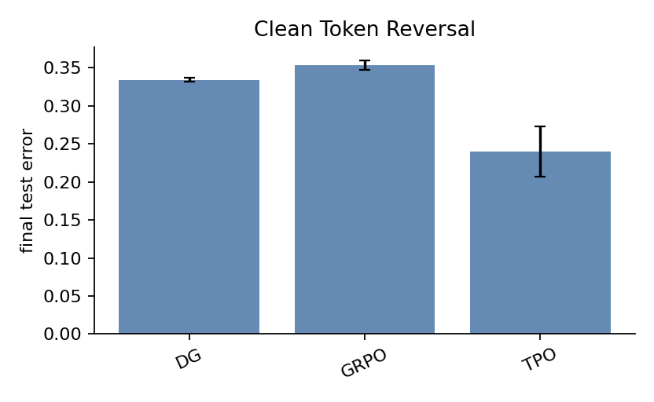
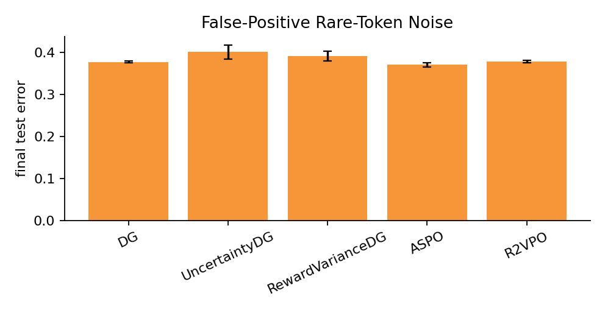
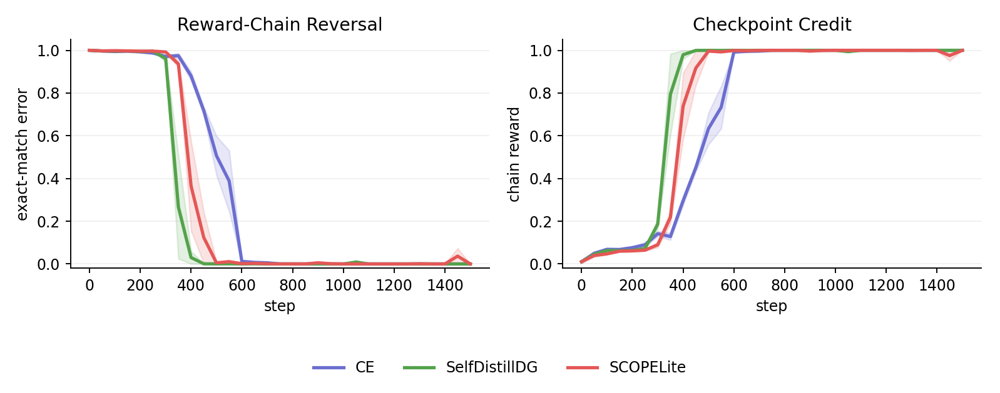
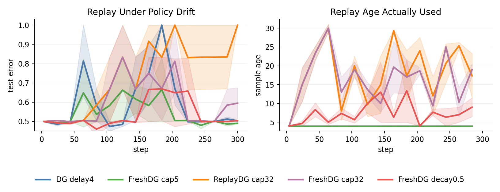
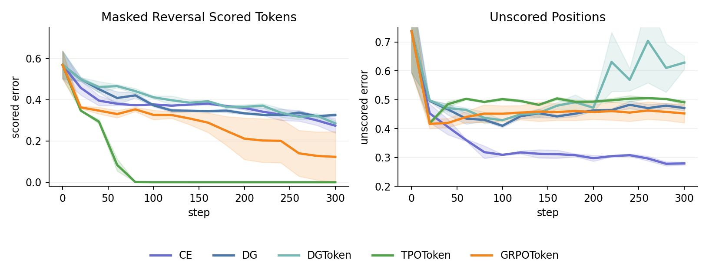
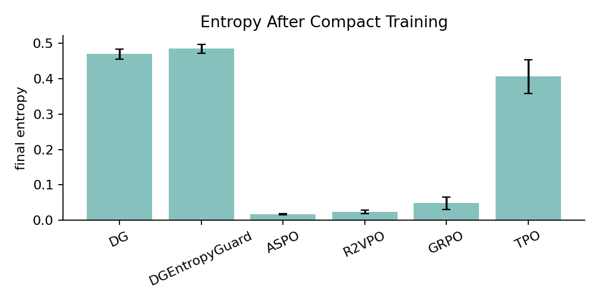

# Results Matrix

Compact GPU sweeps. Three seeds, `batch_size=96`, default token-reversal model unless noted. Treat these as regime checks. The absolute numbers move a bit with seed and horizon; the ordering between methods and the shape of the failure modes do not.

Reproduction commands are in [`sweep_manifest.md`](sweep_manifest.md). Figures (including those embedded in the top-level README) regenerate with `python rl_sandbox/analysis/plot_evidence.py`.

## Token reversal: clean influence baselines



```bash
python -m rl_sandbox.train --task token_reversal --batch_size 96 \
  --num_steps 300 --eval_every 20 --num_seeds 3
```

| Method | Extra args | Final `test_error` |
| --- | --- | --- |
| `DG` | none | `0.3345 +/- 0.0043` |
| `GRPO` | `--group_size 8 --inner_epochs 4` | `0.3536 +/- 0.0106` |
| `TPO` | `--group_size 8 --inner_epochs 4` | `0.2399 +/- 0.0573` |

`TPO` is the strongest in this compact run. The entropy sweep below shows the win does not come from faster entropy collapse alone.

## Reward-noise robustness



```bash
python -m rl_sandbox.train --task token_reversal --batch_size 96 \
  --reward_noise 0.2 --reward_noise_mode false_positive_rare_token \
  --num_steps 300 --eval_every 20 --num_seeds 3
```

| Method | Extra args | Final `test_error` | Final entropy |
| --- | --- | --- | --- |
| `DG` | none | `0.3778 +/- 0.0034` | `0.9599 +/- 0.0510` |
| `UncertaintyDG` | none | `0.4013 +/- 0.0286` | `1.0052 +/- 0.0643` |
| `FilteredDG` | default threshold `0.5` | `0.3778 +/- 0.0034` | `0.9599 +/- 0.0510` |
| `FilteredDG` | `--uncertainty_threshold 0.2` | `0.6536 +/- 0.1260` | `1.0322 +/- 0.0297` |
| `FilteredDG` | `--uncertainty_threshold 0.3` | `0.3810 +/- 0.0129` | `0.9883 +/- 0.0647` |
| `RewardVarianceDG` | none | `0.3921 +/- 0.0209` | `0.7879 +/- 0.0360` |
| `ASPO` | none | `0.3708 +/- 0.0095` | `0.1531 +/- 0.0589` |
| `R2VPO` | none | `0.3787 +/- 0.0042` | `0.1811 +/- 0.0428` |

`ASPO` wins on final error but pays for it with very low entropy. `UncertaintyDG` and `RewardVarianceDG` are more conservative but slower. `FilteredDG` is brittle: the batch-level uncertainty proxy in ungrouped runs makes the threshold either keep every batch (default) or drop every batch (`0.2`).

## Reward-chain dense correction



```bash
python -m rl_sandbox.train --task chain_reversal --batch_size 96 \
  --eval_every 50 --num_seeds 3
```

At 300 steps, exact-match `test_error` is too strict to judge the task: even oracle `CE` finishes near `0.9867`. At 1500 steps the task is learnable.

| Method | Steps | Final `test_error` | First zero-error step |
| --- | ---: | --- | --- |
| `CE` | `1500` | `0.0000 +/- 0.0000` | `733.3333 +/- 57.7350` |
| `SelfDistillDG` | `1500` | `0.0000 +/- 0.0000` | `466.6667 +/- 125.8306` |
| `SCOPELite` | `1500` | `0.0000 +/- 0.0000` | `533.3333 +/- 104.0833` |

The earlier weak `SCOPELite` reading was an under-budget exact-match artifact, not a loss failure. Dense correction is fine here.

## Freshness-aware replay



```bash
python -m rl_sandbox.train --task token_reversal --batch_size 96 \
  --delay 4 --num_steps 300 --eval_every 20 --num_seeds 3
```

| Method | Replay args | Final `test_error` | Mean replay age |
| --- | --- | --- | --- |
| `DG` | none | `0.5032 +/- 0.0080` | n/a |
| `ReplayDG` | `--replay_capacity 5` | `0.5032 +/- 0.0080` | `4.0000 +/- 0.0000` |
| `FreshDG` | `--replay_capacity 5` | `0.4902 +/- 0.0049` | `4.0000 +/- 0.0000` |
| `ReplayDG` | `--replay_capacity 32` | `0.9997 +/- 0.0006` | `18.0667 +/- 9.5237` |
| `FreshDG` | `--replay_capacity 32` | `0.5946 +/- 0.1391` | `16.4667 +/- 7.9418` |
| `FreshDG` | `--replay_capacity 32 --replay_age_decay 0.5` | `0.5048 +/- 0.0082` | `7.4444 +/- 5.5496` |

Two regimes. Capacity `5` at delay `4` is fixed-age stale replay and `FreshDG` is slightly more stable than delayed `DG`. Capacity `32` is a stale-buffer stress test: samples are typically much older than the nominal delay, and entropy collapses unless freshness decay is strong enough to suppress the very old ones.

## Masked reversal: partial credit



```bash
python -m rl_sandbox.train --task masked_reversal --batch_size 96 \
  --num_steps 300 --eval_every 20 --num_seeds 3
```

Grouped and token-candidate methods additionally use `--group_size 8`; token-candidate methods use `--inner_epochs 4`.

| Method | Extra args | Scored `test_error` | Unscored `test_error` |
| --- | --- | --- | --- |
| `CE` | none | `0.2738 +/- 0.0612` | `0.2793 +/- 0.0087` |
| `DG` | none | `0.3260 +/- 0.0132` | `0.4711 +/- 0.0149` |
| `DGToken` | none | `0.2851 +/- 0.0234` | `0.6286 +/- 0.0392` |
| `TEMPO` | `--group_size 8` | `0.4975 +/- 0.0098` | `0.5018 +/- 0.0049` |
| `TPOToken` | `--group_size 8 --inner_epochs 4` | `0.0000 +/- 0.0000` | `0.4910 +/- 0.0133` |
| `GRPOToken` | `--group_size 8 --inner_epochs 4` | `0.1229 +/- 0.2126` | `0.4525 +/- 0.0560` |

The cleanest partial-credit result is `TPOToken`: scored suffix to zero error, unscored positions near chance. That is what targeted token credit is supposed to do. `DGToken` improves the scored suffix relative to sequence-level `DG` but sacrifices unscored-token accuracy because its return-to-go credit is concentrated on scored positions. `TEMPO` is mostly out of regime here: all three seeds stop early once grouped rollouts no longer provide enough mixed-reward batches.

## Entropy-collapse diagnostics



```bash
python -m rl_sandbox.train --task token_reversal --batch_size 96 \
  --entropy_diagnostics true --num_steps 300 --eval_every 20 --num_seeds 3
```

Grouped methods additionally use `--group_size 8 --inner_epochs 4`.

| Method | Extra args | Final `test_error` | Final entropy | First entropy `<= 0.1` |
| --- | --- | --- | --- | --- |
| `DG` | none | `0.3345 +/- 0.0043` | `0.4695 +/- 0.0243` | n/a |
| `DGEntropyGuard` | none | `0.3358 +/- 0.0064` | `0.4847 +/- 0.0219` | n/a |
| `ASPO` | none | `0.3742 +/- 0.0040` | `0.0174 +/- 0.0020` | `113.3333 +/- 11.5470` |
| `R2VPO` | none | `0.3754 +/- 0.0023` | `0.0244 +/- 0.0087` | `106.6667 +/- 11.5470` |
| `GRPO` | `--group_size 8 --inner_epochs 4` | `0.3536 +/- 0.0106` | `0.0488 +/- 0.0305` | `53.3333 +/- 11.5470` |
| `TPO` | `--group_size 8 --inner_epochs 4` | `0.2399 +/- 0.0573` | `0.4057 +/- 0.0824` | n/a |

| Method | Whole-run `batch_delta_entropy` | Early `batch_delta_entropy` | Whole-run positive-advantage entropy drop |
| --- | --- | --- | --- |
| `DG` | `-0.0020 +/- 0.0069` | `-0.0041 +/- 0.0096` | `0.0034 +/- 0.0075` |
| `DGEntropyGuard` | `-0.0020 +/- 0.0080` | `-0.0037 +/- 0.0107` | `0.0027 +/- 0.0069` |
| `ASPO` | `-0.0029 +/- 0.0092` | `-0.0073 +/- 0.0120` | `0.1067 +/- 0.1761` |
| `R2VPO` | `-0.0029 +/- 0.0104` | `-0.0067 +/- 0.0141` | `0.0983 +/- 0.1682` |
| `GRPO` | `-0.0070 +/- 0.0234` | `-0.0090 +/- 0.0263` | `0.0593 +/- 0.0957` |
| `TPO` | `0.0026 +/- 0.0208` | `-0.0011 +/- 0.0215` | `0.0049 +/- 0.0187` |

`GRPO` collapses entropy earliest. `ASPO` and `R2VPO` reach very low entropy around step 100 despite only middling final accuracy. `TPO` keeps entropy near `DG` while reaching the best final error, which is the main reason I do not read its win as "just faster collapse." `DGEntropyGuard` modestly reduces positive-advantage entropy drop while keeping `DG`'s accuracy, but the effect is small on this easy task.
